# 01 - Gimp pour réaliser des visuels très simples.

Ce tutoriel est prévu pour apprendre à utiliser les fonctions élémentaires de Gimp. Nous y réaliserons un visuel très simple : un texte sur fond uni, signé avec le logo du parti.

Mais avant de commencer, pourquoi ce logiciel ? Il y a deux raisons majeures :
* Il est disponible gratuitement et légalement sur les trois systèmes d'exploitation principaux (Windows, MacOs, GNU/Linux), et peut donc facilement servir de standard entre des gens qui n'utilisent pas tou·te·s les mêmes solutions techniques (comme c'est notre cas au parti).
* Même si son utilisation est plus austère, il permet d'obtenir des résultats comparables à ceux de la suite Adobe. C'est un logiciel puissant, même si on l'utilise ici pour faire des choses élémentaires.
* C'est un logiciel libre, qui apporte donc des garanties fortes en termes de protection des données, de sécurité, etc.

Avant tout, il faut télécharger et installer Gimp en utilisant l'exécutable fourni [à cette adresse](https://www.gimp.org/downloads/), puis le démarrer.

## Créer une nouvelle image et découvrir l'interface.

### Créer une nouvelle image.

Commençons par créer une nouvelle image. Pour ce faire, on clique en haut à sur Fichier ⟶ Nouvelle image.
La fenêtre suivante s'ouvre alors : elle permet de choisir les dimensions de la nouvelle image.

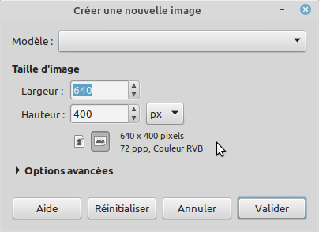

On sait que, sur la plupart des réseaux sociaux, il y a des dimensions optimales pour qu'une image apparaisse bien, qu'elle ne soit pas rognée, etc. Sur Facebook, une image partagée ne doit pas excéder les 1200 x 630 pixels (1200 pixels de large sur 630 pixels de haut).
Mais pour notre premier visuel, on va faire ce qu'il y a de plus simple : un carré. Au lieu des valeurs pré-remplies, il faut donc entrer, pour créer notre nouvelle image, une largeur et une hauteur toutes deux égales à 600.

### Découvrir l'interface.

On se retrouve donc normalement avec l'écran suivant.

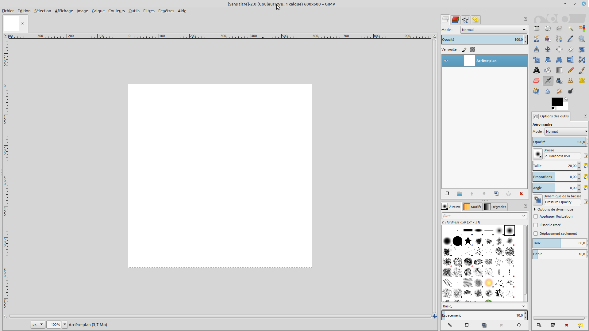

Il se décompose comme suit :
* Le panneau principal contient l'image sur laquelle on est en train de travailler : ici, ce n'est encore qu'un carré blanc.
* Le premier panneau de droite présente les calques qui constituent notre image. Nous y reviendrons.
* Le dernier panneau de droite présente les différents outils disponibles pour modifier l'image : brosse, pot de peinture, pipette, etc.
* Au-dessus du panneau principal, la barre de menu permet d'accéder à des options plus précises.

Nous allons immédiatement mettre les doigts dans la barre de menu, en cliquant sur l'onglet Calques ⟶ Transparence ⟶ Ajouter un canal alpha.
Cette opération consiste à activer la transparence (le "canal alpha"), dont nous aurons besoin pour "imprimer" le logo du parti par-dessus l'image.

## Colorier l'arrière-plan.

### Choisir une couleur.

Dans le panneau des outils, on sélectionne une couleur en cliquant sur le bouton indiqué par la flèche rouge :

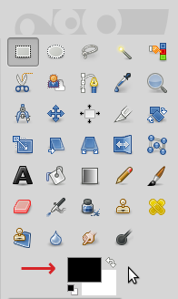

On se retrouve dans la fenêtre suivante :

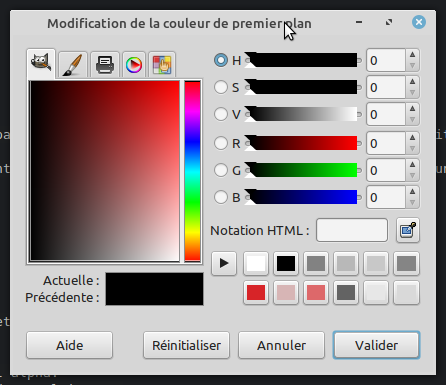

Pour choisir une couleur, on peut utiliser la palette à gauche avec la souris, mais en général, quand on sait déjà laquelle on veut, on utilise directement son code HTML (en remplissant le champ "Notation HTML"). En l'occurence, entrons le code d72428 : c'est un beau rouge. On valide.

### Colorier avec la couleur choisie.

Il faut encore choisir l'outil "Pot de peinture" (sélectionné ci-dessous) :

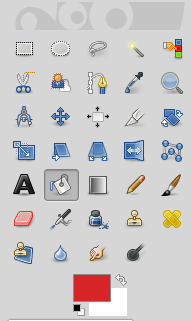

Le pot de peinture permet de remplir une zone de l'image avec la couleur qu'on a choisie. Une fois qu'il est sélectionné, il n'y a plus qu'à cliquer avec sur notre carré blanc pour le colorier entièrement. 

### Résultat après avoir colorié.

Maintenant, l'image devrait ressembler à ceci :

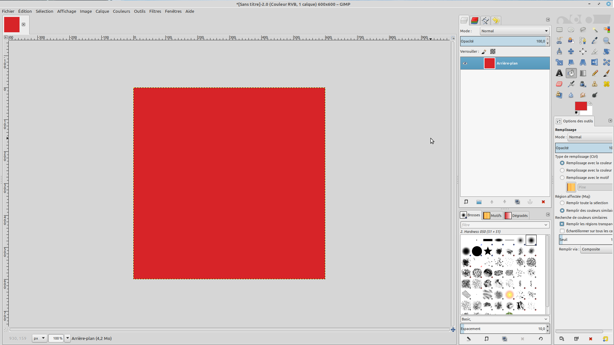

## Écrire le texte.

On va ajouter un slogan plein de bonnes intentions : "Pour aider les soignant·e·s, restons chez nous." On va l'écrire en blanc sur le fond rouge : il faut donc commencer par sélectionner la couleur blanche dans le panneau des outils (sinon, on risque d'écrire en rouge sur fond rouge...).

### Choisir la police du texte.

La police dépend du sentiment qu'on veut faire passer. Ici, puisqu'on veut transmettre de la douceur et de la bienveillance, on va choisir une police ronde, douce, qui imite l'écriture manuscrite : Pacifico, qui peut être téléchargée [ici](https://www.dafont.com/fr/pacifico.font).

On sélectionne l'outil "Texte" :

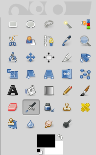

Et, dans les options du texte, juste en-desous, on peut sélectionner notre police Pacifico et centrer le texte :

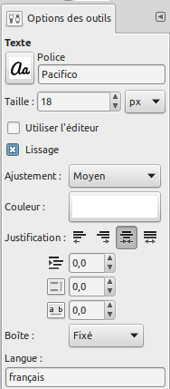

### Choisir la taille du texte.

Pour commencer à écrire, il suffit de cliquer avec l'outil "Texte" sur l'image. Une fois notre texte tapé, on peut l'agrandir, en le sélectionnant et en augmentant la taille de police. On peut changer sa position en utilisant les "poignées" du cadre de texte. Il vaut mieux qu'il soit aussi grand que possible, et qu'il soit positionné au milieu de la page, pour être vu immédiatement quand les gens scrollent sur leur mur Facebook.

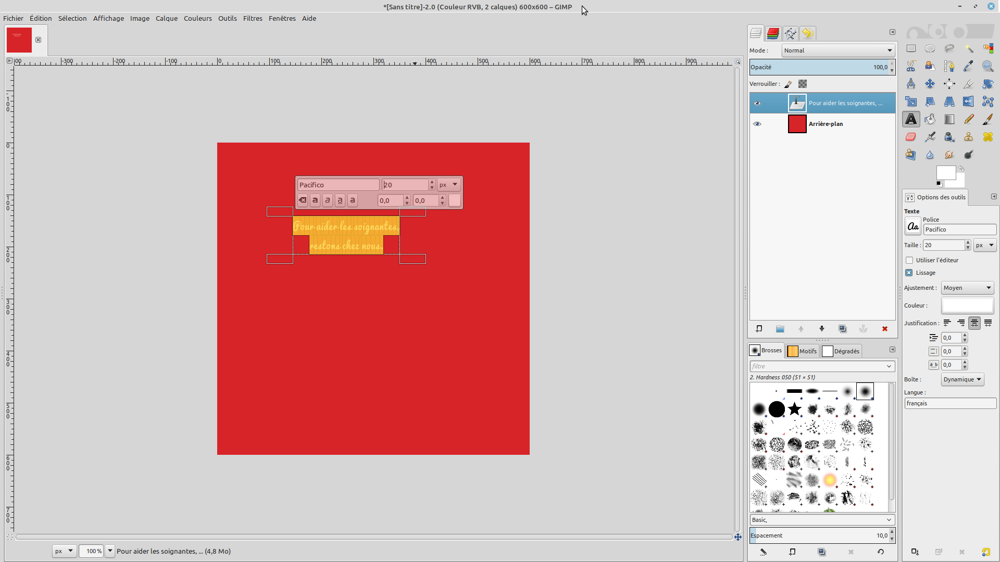

### Résultat après avoir écrit le texte.

Essayons d'obtenir un résultat comme celui-là :

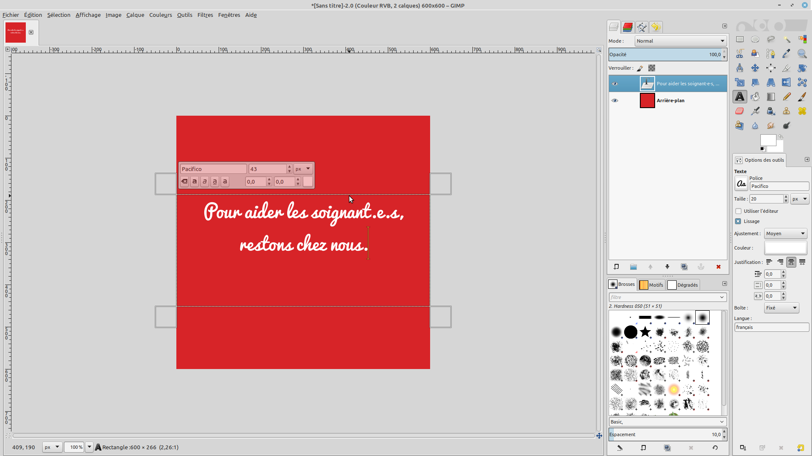

## Signer avec le logo.

### Sa familiariser avec les calques.

Jetons un œil au premier panneau à droite de l'image, qui liste les différents calques de l'image :

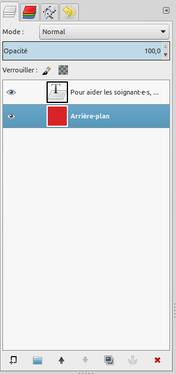

Il y a pour l'instant 2 calques : l'arrière-plan et le texte. Cela signifie que notre image est faite de 2 couches, l'une sur l'autre.

### Importer un nouveau calque.

On va importer notre logo sous la forme d'un nouveau calque, intercalé entre l'arrière-plan et le texte.

1- On commence par récupérer la version du logo qu'on veut utiliser, par exemple [celle-ci](https://github.com/PCF-Nanterre/graphisme/blob/master/ressources/logos/pcf_ancien_blanc.png).

2- On insère le calque du logo dans notre image en cliquant sur Fichier ⟶ Ouvrir en tant que calques. Un nouveau calque est apparu dans notre panneau des calques ! On fait glisser-déposer pour qu'il soit au dessus du texte :

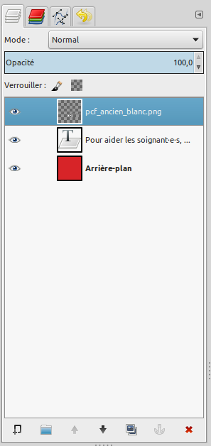

### Manipuler notre nouveau calque.

Il est néanmoins beaucoup trop gros : on va le redimensionner. Clic droit sur le nouveau calque, puis Échelle et taille du calque. On va se contenter de 100 pixels en largeur et 100 pixels en hauteur :

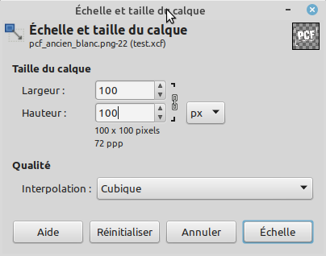

Maintenant, notre logo a la bonne taille, mais il n'est pas à la bonne place sur l'image. On va se servir de l'outil de déplacement :

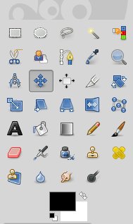

Avec l'outil de déplacement, on clique sur le logo, et on fait glisser-déposer pour le déposer où on veut, en l'occurence, un peu en dessous du texte.

### Résultat après importation du logo.

Le visuel est fini. Il devrait maintenant ressembler à ceci :

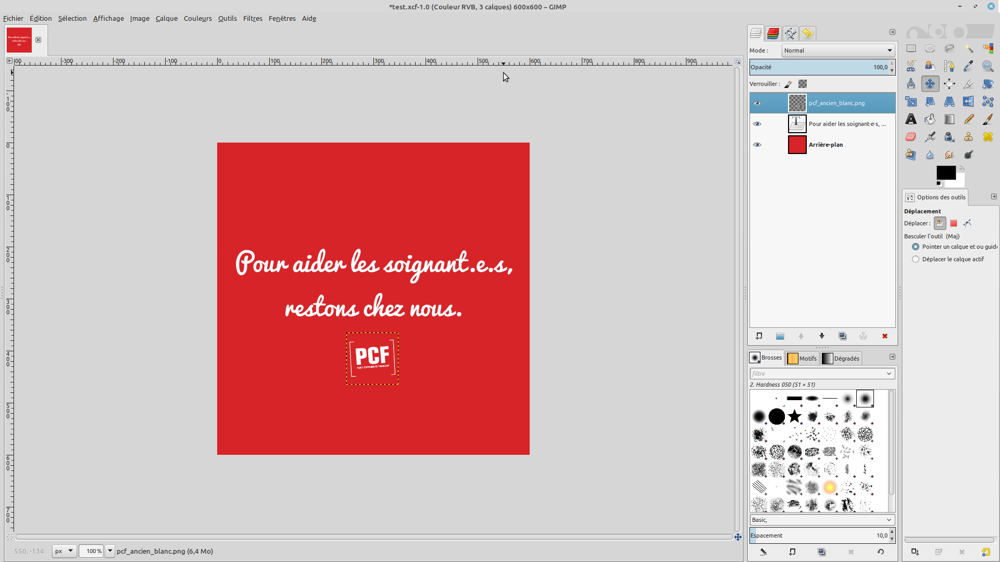

## Conclusion

Il n'y a plus qu'à :
* L'enregistrer en faisant Fichier ⟶ Enregistrer sous. C'est ce fichier qu'il faudra ouvrir si on veut retravailler notre modèle, changer, le texte, manipuler les calques, etc.
* L'exporter dans un format plus léger (png ou jpg), en faisant Fichier ⟶ Exporter. C'est ce fichier qu'on diffusera sur les réseaux sociaux.
