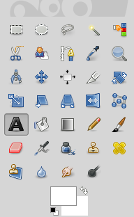
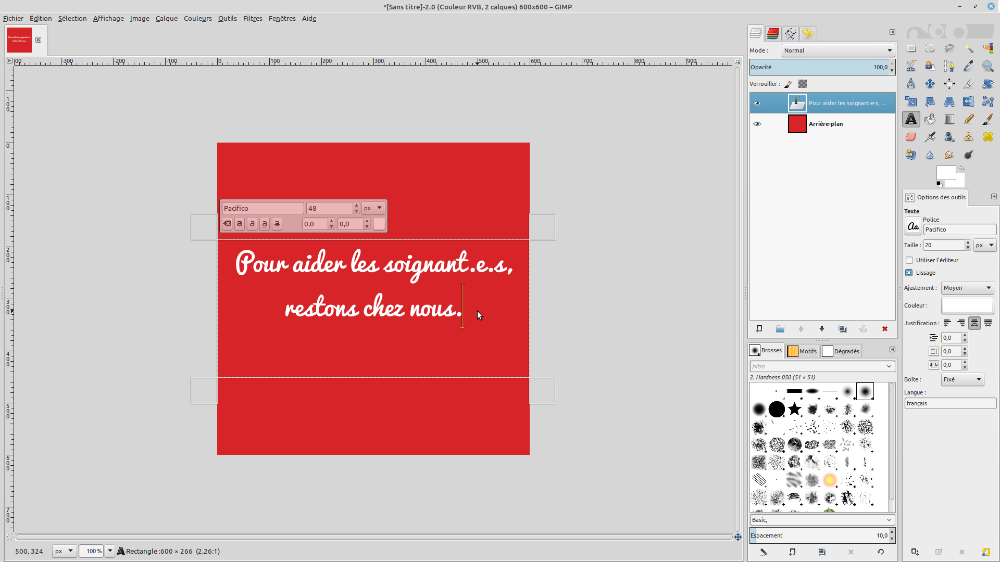

# 01 - Gimp pour réaliser des visuels très simples

Ce tutoriel est prévu pour apprendre à utiliser les fonctions élémentaires de Gimp. Nous y réaliserons un visuel très simple : un texte sur fond uni, signé avec le logo du parti.
Mais avant tout, il faut télécharger et installer Gimp en utilisant l'exécutable fourni [à cette adresse](https://www.gimp.org/downloads/), puis le démarrer.

## Créer une nouvelle image et découvrir l'interface

### Créer une nouvelle image

Commençons par créer une nouvelle image. Pour ce faire, on clique sur "Fichier" en haut à gauche, puis sur "Nouvelle image".
La fenêtre suivante s'ouvre alors : elle permet de choisir les dimensions de la nouvelle image.

On sait que, sur la plupart des réseaux sociaux, il y a des dimensions optimales pour qu'une image apparaisse bien, qu'elle ne soit pas rognée, etc. Sur Facebook, une image partagée ne doit pas excéder les 1200 x 630 pixels (1200 pixels de large sur 630 pixels de haut).
Mais pour notre premier visuel, on va faire ce qu'il y a de plus simple : un carré. Au lieu des valeurs pré-remplies, il faut donc entrer, pour créer notre nouvelle image, une largeur et une hauteur toutes deux égales à 600.

### Découvrir l'interface

On se retrouve donc normalement avec l'écran suivant.

Il se décompose comme suit :
* Le panneau principal contient l'image sur laquelle on est en train de travailler : ici, ce n'est encore qu'un carré blanc.
* Le premier panneau de droite contient les calques qui constituent notre image. Nous y reviendrons.
* Le dernier panneau de droite présente les différents outils disponibles pour modifier l'image : brosse, pot de peinture, pipette, etc.
* Au-dessus du panneau principal, la barre de menu permet d'accéder à des options plus précises.

Nous allons immédiatement mettre les doigts dans la barre de menu, en cliquant sur l'onglet Calques ⟶ Transparence ⟶ Ajouter un canal alpha.
Cette opération consiste à activer la transparence (le "canal alpha"), dont nous aurons besoin pour "imprimer" le logo du parti par-dessus l'image.

## Colorier l'arrière-plan

### Sélectionner une couleur

Dans le panneau des outils, on sélectionne une couleur :

On se retrouve dans la fenêtre suivante :

Pour choisir une couleur, on peut utiliser la palette à gauche avec la souris, mais en général, quand on sait déjà laquelle on veut, on utilise directement son code HTML. En l'occurence, entrons le code d72428 : c'est un beau rouge. On valide.

### Colorier

Il faut encore choisir l'outil "Pot de peinture", qui permet de remplir une zone de l'image avec la couleur sélectionnée :

Une fois que le pot de peinture est sélectionné, il n'y a plus qu'à cliquer avec sur notre carré blanc pour le colorier entièrement. 

### Résultat

Maintenant, l'image devrait ressembler à ceci :

## Ajouter le texte

On va ajouter un slogan plein de bonnes intentions : "Pour aider les soignant·e·s, restons chez nous." On va l'écrire en blanc sur le fond rouge : il faut donc commencer par sélectionner la couleur blanche dans le panneau des outils.

### Choix de la police

La police dépend du sentiment qu'on veut faire passer. Ici, puisqu'on veut transmettre de la douceur et de la bienveillance, on va choisir une police ronde, douche, qui imite l'écriture manuscrite : Pacifico, qui peut être téléchargée [ici](https://www.dafont.com/fr/pacifico.font).

On sélectionne l'outil "Texte" :

Et, dans les options du texte, juste en-desous, on peut sélectionner notre police Pacifico et centrer le texte :

### Taille du texte

Pour commencer à écrire, il suffit de cliquer avec l'outil "Texte" sur l'image. Une fois notre texte tapé, on peut l'agrandir, en le sélectionnant et en augmentant la taille de police. On peut changer sa position en utilisant les "poignées" du cadre de texte. Il vaut mieux qu'il soit aussi grand que possible, et qu'il soit positionné au milieu de la page, pour être vu immédiatement quand les gens scrollent sur leur mur Facebook.

### Résultat

Essayons d'obtenir un résultat comme celui-là :

