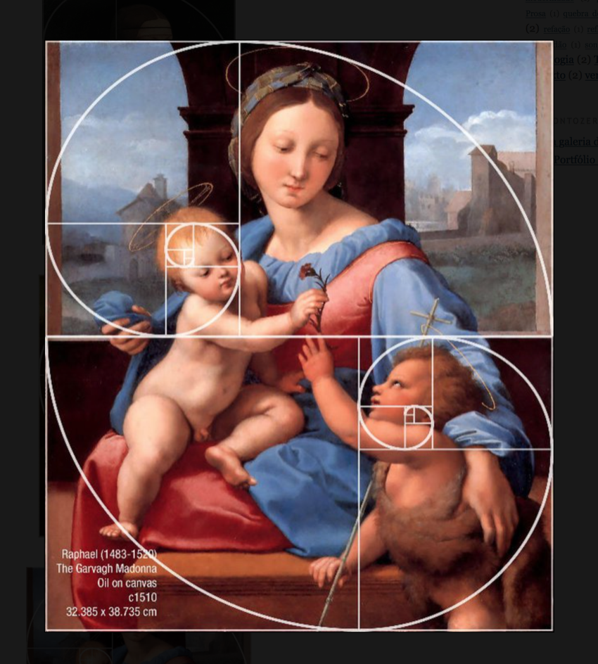

# 02 - Gimp pour réaliser des visuels avec de vraies illustrations.

Maintenant qu'on a appris à réaliser des visuels très simples (un slogan, un fond, un logo) dans le [précédent tutoriel](gimp_O1_Visuel_simple.md), on peut passer à l'étape suivante : des visuels avec de vraies images.

## Principe d'esthétique : le nombre d'or

L'œil humain est ainsi fait qu'il est particulièrement sensible à certaines proportions, et singulièrement au nombre d'or ϕ :

Cette formule est un peu abstraite. En fait, elle permet de définir un rectangle d'or, c'est à dire un rectangle dont le rapport de la longueur sur la largeur vaut ϕ :

Toujours trop abstrait ? Maintenant, jetons un œil à quelques joyaux de l'architecture :

De l'histoire de l'art :

Ou même du design :

On va donc essayer de suivre les proportions d'or en composant nos visuels pour avoir le même succès que Raphaël ou Steve Jobs ^^ Notre but va donc être de disposer les différents éléments du visuel dans les rectangles d'or, en jouant sur leur taille pour que l'ensemble paraisse harmonieux.

Évidemment, Gimp fournit ce qu'il faut pour ça.

## Ouvrir une image.

Supposons que nous voulions faire un visuel pour saluer la solidarité médicale de Cuba. On veut mettre en exergue la citation "Nous larguerons des médecins, pas des bombes", qui décrit cette démarche et que Fidel Castro a prononcée dans les années 80.

On commence par chercher une belle photo qui se prête à ce genre de message. Disons celle-ci :

On la charge dans Gimp (Fichier ⟶ Ouvrir) et on commence par la manipulation qu'on a déjà faite la dernière fois : Calques ⟶ Transparence ⟶ Ajouter un canal alpha.

## Redimensionner l'image.

Ensuite, dans le panneau des outils, on sélectionne l'outil de sélection rectangulaire, en précisant "sections d'or" dans le menu des guides (indiqué par la flèche rouge) :

On encadre l'image avec la sélection régulière, ce qui fait apparaître les guides :

Visiblement, aucune section d'or ne permet d'écrire correctement notre texte : ce serait vraiment très petit, ou il faudrait écrire par-dessus l'image.
Qu'à cela ne tienne, nous allons la redimensionner. Élargissons notre sélection de manière à ce que la photo de Castro soit à la gauche d'un rectangle d'or (nous écrirons le texte à sa droite) :

On remarque que notre nouvelle image devra mesurer 848 pixels de largeur.

On clique sur Image ⟶ Rogner selon la sélection (qui supprime la partie superflue de l'image), puis sur Image ⟶ Taille du canevas. Il n'y a plus qu'à sélectionner notre nouvelle largeur et à indiquer que tous les calques doivent être redimensionnés :

## Boucher les trous.

Évidemment, la partie droite de l'image est maintenant transparente. On veut la colorier de la même couleur d'arrière-plan que la photo : un "presque noir".
Rien de plus simple, il suffit de sélectionner l'outil Pipette :

Et de cliquer sur une zone de l'image qui a la couleur désirée. Il ne reste plus qu'à colorier la partie transparente de l'image, en utilisant l'outil Pot de peinture, comme on l'a déjà vu :

## Ajouter le texte et le logo en suivant les sections d'or

En utilisant l'outil de sélection rectangulaire, on repère les sections d'or et on les utilise pour positionner le texte (ici, on utilise la police [Bebas Neue](https://www.dafont.com/fr/bebas-neue.font) pour la citation, et [Ubuntu](https://design.ubuntu.com/font/) pour le nom de Castro) :

Il n'y a plus qu'à enregistrer l'image et à l'exporter en png.
Une image comme celle-là marchera très bien, la preuve :

