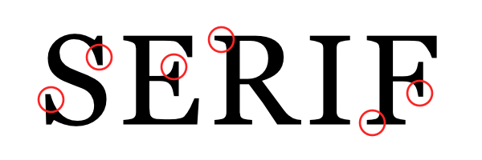
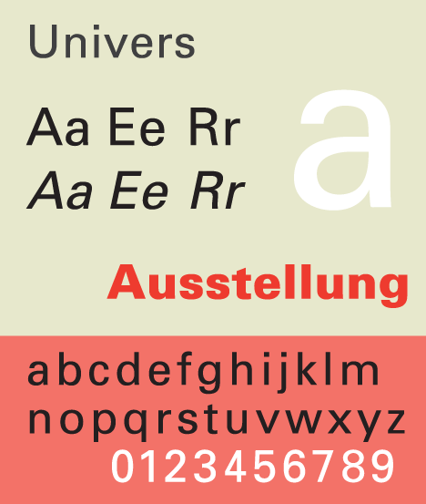
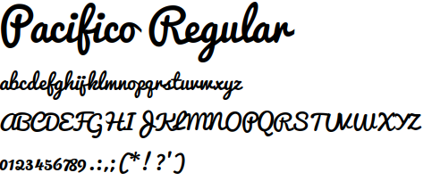
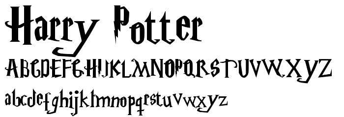
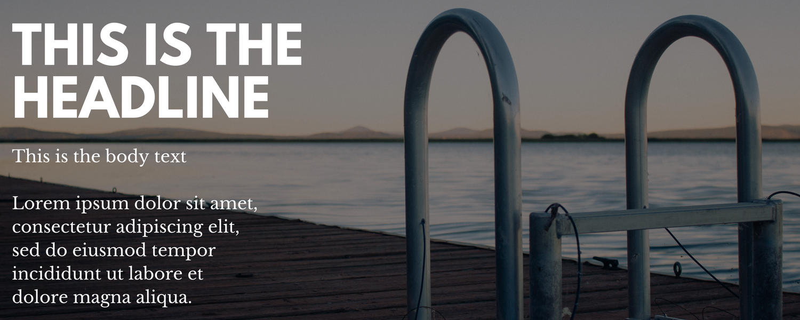
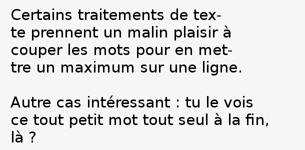

# Bien choisir sa police de caractères

Il n'est pas toujours facile de savoir quelle police de caractères est utile dans quelle circonstance, ni comment les composer agréablement dans un visuel. Ce tutoriel permet d'acquérir les bases en typographie.

Mais avant tout, il faut savoir installer de nouvelles polices de caractères. C'est très simple, mais tout dépend du système d'exploitation qu'on utilise : pour celles et ceux qui sont sous Windows, un petit guide est disponible [ici](https://www.windows8facile.fr/w10-installer-police-font-caracteres-ttf-otf/).

Commençons par la règle la plus importante.

## Ne jamais utiliser Comic Sans MS

Il ne faut jamais, jamais utiliser Comic Sans MS. À force d'avoir été plaquée partout depuis 30 ans, cette police est devenue synonyme d'amateurisme et de mauvaise qualité. De manière générale, il ne faut utiliser aucune des polices standard (Times New Roman, Arial, etc). Elles ont été vues et revues partout et sont désormais imbuvables.

## Les différentes familles de polices de caractères

Pour bien choisir sa police/ses polices quand on fait un visuel, il faut d'abord connaître les principales familles et leurs usages. Il y en a beaucoup, mais nous ne les verrons pas toutes ici.

Pour installer une nouvelle police de caractères sur son ordinateur quand on est sous Windows, un petit guide est disponible .

### Les polices avec empattements (Serif)

Les polices Serif sont les polices les plus anciennes (elles datent du XVe siècle), celles qui ont de petits empattements à l'extrémité des lettres. 

Elles ont deux utilités :
* Quand on écrit un texte long (par exemple un tract), il faut privilégier une police Serif pour le corps du texte, parce que les empattements permettent à l'œil de structurer la lecture et de moins perdre le fil.
* Dans les visuels, elles renvoient une impression de sérieux, de classicisme, de "chic". Il faut les utiliser quand on veut exprimer quelque chose de solennel (par exemple une citation de Victor Hugo).

C'est ce sentiment de sérieux qu'une marque comme Tiffany & Co (joaillerie de luxe) essaie de dégager dans son logo :

Conseil pour commencer : [Clarendon](http://fontsgeek.com/fonts/Clarendon-Regular) ou [Palatino](https://www.dafontfree.io/palatino-font-free/)

### Les polices sans empattements (Sans Serif)

Elles ont été mises à la mode avec l'arrivée du web mais viennent de la tradition des affichistes du XIXe siècle. Elles se caractérisent par l'absence d'empattements, qui leur donnent un caractère épuré, très lisible. 

Elles renvoient une impression de décontraction et de modernité. C'est ce sentiment que Google a voulu dégager quand ils ont refait leur logo :

Conseil pour commencer : [Ubuntu](https://design.ubuntu.com/font/), ou, seulement pour les titres, [Bebas Neue](https://www.dafont.com/fr/bebas-neue.font)

### Les polices mécanes ou "égyptiennes" (Slab Serif)

Conseil pour commencer : [Aleo](https://www.fontsquirrel.com/fonts/aleo) ou [Rockwell](https://www.dafontfree.net/freefonts-rockwell-f55077.htm)

Les polices mécanes sont une variante des polices Serif, où les empattements sont carrément des blocs, presque rectangulaires (ce qui leur donne un aspect... mécanique). Elles sont issues de certains modèles de machines à écrire.

Elles permettent d'exprimer la force, la conviction, l'agressivité. On peut les retrouver dans les logos de marques de voitures, comme Honda :

### Les polices scriptes

Ce sont les polices qui imitent l'écriture manuscrite :

Elles permettent d'exprimer la douceur, la chaleur, la bienveillance. C'est l'idée qu'Instagram essaie de transmettre dans son logo :

Attention, il faut les utiliser pour des textes très courts, parce qu'elles réduisent la lisibilité.

Conseil pour commencer : [Pacifico](https://www.dafont.com/fr/pacifico.font)

### Les polices décoratives ou "fantaisie"

Ce sont des polices dont les caractères sortent des règles typographiques et se rapprochent davantage du dessin :

Elles permettent d'évoquer la créativité, le plaisir, le jeu. Ce n'est pas étonnant si une entreprise comme Toys'R'Us a choisi cette démarche dans son logo :

Il faut les utiliser avec beaucoup de parcimonie parce qu'elles renvoient facilement un sentiment d'amateurisme ou de vulgarité.

Conseil pour commencer : [Dry Brush](https://www.dafont.com/fr/dry-brush.font)

## Conseils typographiques importants

### Marier plusieurs polices

Lorsqu'on marie plusieurs polices dans un visuel (par exemple entre un titre et un sous-titre, ou deux informations qui n'ont pas la même valeur, comme l'intervenant à un meeting et le lieu de rendez-vous), il faut privilégier le contraste, et ne surtout pas choisir deux polices qui se ressemblent. En général, on marie une police Sans Serif (pour l'information la plus importante) et une police Serif (en sous-titre). Il faut aussi varier les tailles, la graisse (l'une en "gras", l'autre non), et, éventuellement, les couleurs et la capitalisation (l'une en lettres capitales, l'autre non).

Par contre, il faut limiter le nombre de polices différentes sur un même visuel. En général, 3 est un grand maximum (et quand on peut, il vaut mieux se contenter de 2).

### Attention aux majuscules

Les textes "tout en majuscules" sont moins lisibles et renvoient un sentiment agressif. Il faut donc réserver cette méthode à des portions courtes, pour les informations qu'on veut absolument mettre en avant.

### Équilibre

Il faut éviter de couper un mot entre deux lignes, mais également de finir un bloc de texte avec un mot tout seul : l'un et l'autre déséquilibrent la lecture.

### Mettre en avant du texte

Dans un bloc de texte, il est utile de mettre les parties les plus importantes en avant, par exemple en les mettant en gras : cela permet de structurer la lecture et la rend plus agréable. Mais pour que cette méthode fonctionne, il ne faut pas en abuser : si plus de 10% d'un texte est en gras par exemple, il devient illisible. De même, il ne faut pas utiliser plusieurs méthodes de mise en avant différentes (gras, italique, souligné) dans un même texte.

### Accentuation des majuscules

Les règles typographiques prévoient qu'on accentue aussi les lettres capitales afin de réduire l'effort du cerveau pour comprendre le texte, comme dans Élévateur ou Être. C'est moins simple sous Windows que sous Linux et Mac, il faut donc utiliser ce qu'on appelle les codes ASCII et qui sont décrits [ici](https://www.clubic.com/tutoriels/article-846166-1-comment-majuscules-accent.html). Il est toujours possible, si c'est trop compliqué, de copier-coller ces caractères depuis internet.

### L'écriture inclusive et le point médian

Lorsqu'on écrit un texte en écriture inclusive (citoyen·ne·s, habitant·e·s...), le point qui sépare la forme féminine et la forme masculine n'est pas le point habituel ("en bas"), car l'œil est habitué à s'arrêter quand il le croise. Cela hache la lecture. C'est un point spécial qu'il faut utiliser, le point médian, "au milieu". Sous Linux, on l'obtient avec le raccourci clavier **Alt gr + ⇧ Maj + &**. Sous Mac, c'est **Alt + ⇧ Maj + F**. Sous Windows, c'est **Alt + 0183**. Sinon, il est toujours possible de le copier-coller depuis internet.
